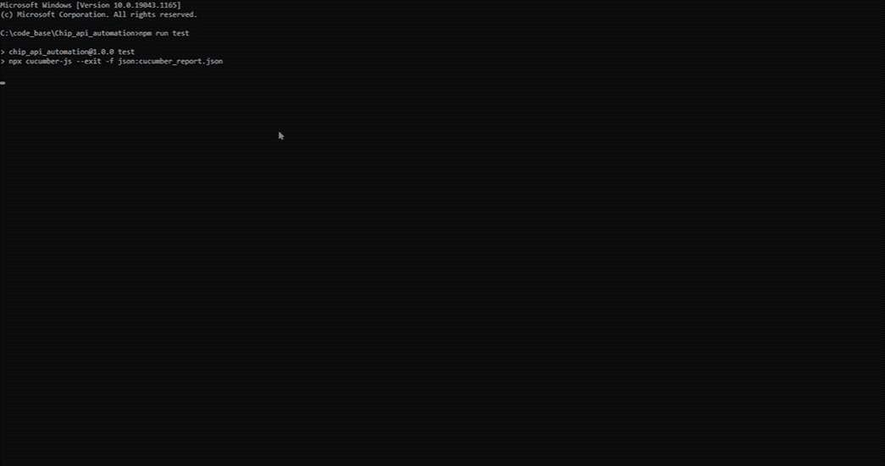
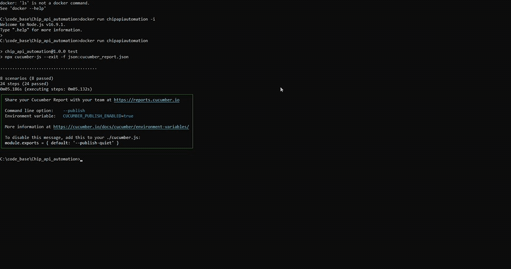
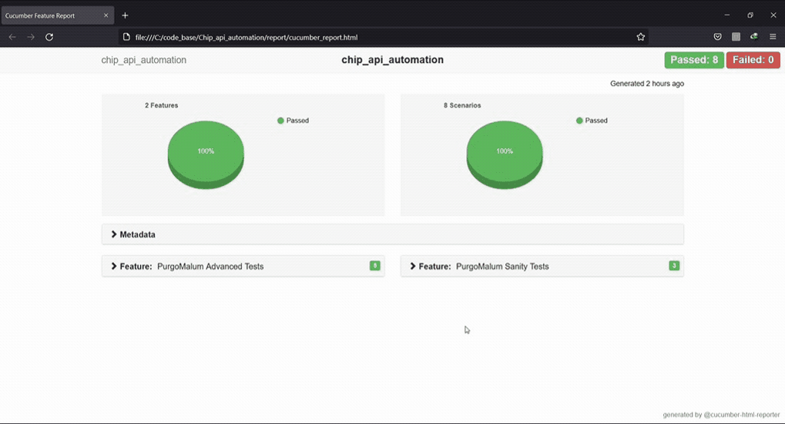

<p align="center">
   <i><strong>BDD API Test Automation Framework
</strong></i>
<p>

### NPM packages used
* @cucumber/cucumber - BDD framework
* ajv - JSON schema validationm 
* axios - Rest Client
* chai - Assert library
* chai-as-promised - Assert library
* cucumber-html-reporter - html reporter
* dotenv - for env file

### Features
* ts-node(typescript execution environment for node) in cucumberOpts. 
* All scripts written with JavaScript & Cucumber Gerkhin.
* Neat folder structures with js files easy to maintain
* Page Object design pattern implementation.
* Extensive hooks implemented for BeforeFeature, AfterScenarios etc in world file under support directory.
* HTML report withAssert errors on failure feature scenarios.


### To Get Started

#### Pre-requisites
1.NodeJS installed globally in the system.
https://nodejs.org/en/download/

2.Visual Studio Code or any

#### Setup Scripts
* Clone the repository into a folder
* Go inside the folder and run following command from terminal/command prompt
```
npm install 
```
* All the dependencies from package.json would be installed in node_modules folder.

#### Run Scripts

* Now just run the test command which starts the test execution
```
npm run test
```


#### Writing Features
```
Feature: PurgoMalum Sanity Tests
    PurgoMalum is a simple, free, RESTful web service for filtering and removing content of profanity, obscenity and other unwanted text.

    Background:
        Given RESTful web service "https://www.purgomalum.com" is up and running

    @sanity
    Scenario Outline: Validating Response Types
        When validating RESTful web service for "<type>" response type with text "this is some test input"
        Then Validate the response "<response>"
        Examples:
            | type  | response                |
            | xml   | this is some test input |
            | json  | this is some test input |
            | plain | this is some test input |
```
#### Writing Step Definitions
    
```
Given(`RESTful web service {string} is up and running`, timeout, async function (url) {
   <!-- implementation -->
})
```

#### Schema for validation (ajv is used for JSON schema validation)
```
class PurgoMalumSchema {
    constructor() {
    }

    /**
   * jsonSchema for success case
   */
    jsonSchema() {
        return {
            type: "object",
            properties: {
                result: { type: "string" }
            },
            required: ["result"],
            additionalProperties: false
        }
    }

    /**
    * jsonSchema for negative case
    */
    jsonErrorSchema() {
        return {
            type: "object",
            properties: {
                error: { type: "string" }
            },
            required: ["error"],
            additionalProperties: false
        }
    }

    
    /**
   * xml for success case
   */
    xmlSchema(text) {
        return `<?xml version="1.0" encoding="UTF-8" standalone="yes"?><PurgoMalum xmlns="http://www.purgomalum.com"><result>${text}</result></PurgoMalum>`
    }

    /**
    * xml for negative case
    */
    xmlErrorSchema(text) {
        return `<?xml version="1.0" encoding="UTF-8" standalone="yes"?><PurgoMalum xmlns="http://www.purgomalum.com"><error>${text}</error></PurgoMalum>`
    }

}

module.exports = { PurgoMalumSchema : new PurgoMalumSchema() };
```

#### Rest Client
Rest Client is under utilities directory in Utilities.js
```
  /**
 * @param {string=} URL - API endpoint.
 * @param {object=} Options - headers, payload and auth.
 */
  async getRequest(URL, options = {}) {
    let response = await axios.get(URL, options);
    expect(response.status).to.match(/^20[0-2]$/);
    return response;
  }

```


#### Cucumber Hooks
Test hooks in world.js under support directory
```
Before(async function (testCase) {
    // console.log(testCase.gherkinDocument.feature.description)
});

After(function (testCase) {
    // console.log(testCase.result.status)
});

```
#### Docker 
Following DockerFile is used to create a docker image and run the container
```
FROM node:16-alpine3.14

WORKDIR /app

# copy project files
COPY . .

# dependencies will be installed only if the package.json file changes
RUN npm ci

# rerun E2E tests only if any of the previous files change
CMD npm run test

# Simple docker file just for demonstration. Advanced concepts to be included in docker compose or groovy script is jenkins pipeline
```


   
#### HTML Reports

report.js is used to backup the existing html report to history folder. 

Current report is in report directory.

```
npm run report
```

